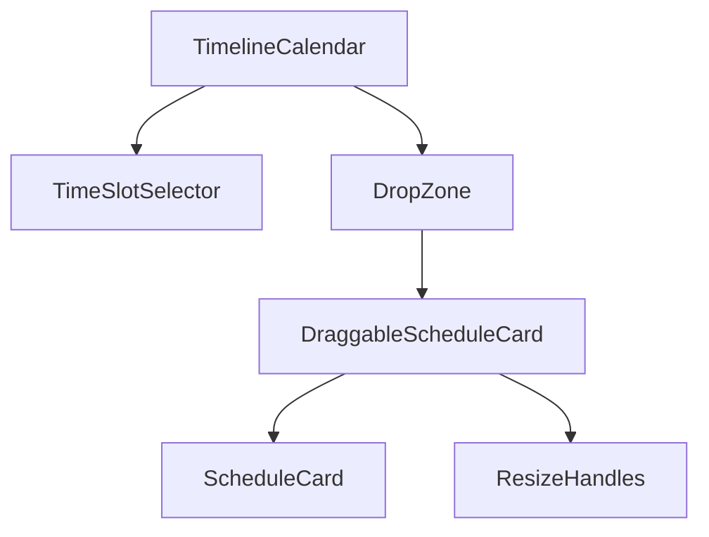
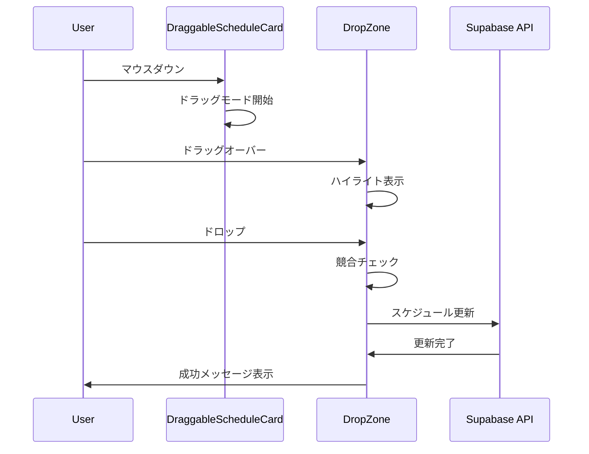

# Design Document - Phase 3: インタラクティブカレンダー機能

## Overview

Googleカレンダーのようなインタラクティブな操作機能を実装します。HTML5 Drag and Drop APIとマウスイベントを使用して、直感的なスケジュール管理を実現します。

## Architecture

### コンポーネント構成

```
TimelineCalendar (既存)
├── DraggableScheduleCard (新規)
│   ├── ScheduleCard (既存)
│   └── ResizeHandles (新規)
├── TimeSlotSelector (新規)
└── DropZone (新規)
```

### 状態管理

```typescript
// ドラッグ状態
interface DragState {
  isDragging: boolean;
  draggedSchedule: Schedule | null;
  dragStartPosition: { x: number; y: number };
  currentPosition: { x: number; y: number };
  targetDate: string | null;
  targetTime: { start: string; end: string } | null;
}

// 選択状態
interface SelectionState {
  isSelecting: boolean;
  selectionStart: { date: string; time: string } | null;
  selectionEnd: { date: string; time: string } | null;
  selectionRect: DOMRect | null;
}

// リサイズ状態
interface ResizeState {
  isResizing: boolean;
  resizeHandle: 'top' | 'bottom' | null;
  originalSchedule: Schedule | null;
  newTime: { start: string; end: string } | null;
}
```

## Components and Interfaces

### 1. DraggableScheduleCard

スケジュールカードをドラッグ可能にするラッパーコンポーネント。

```typescript
interface DraggableScheduleCardProps {
  schedule: Schedule;
  clientName?: string;
  driverName?: string;
  onDragStart: (schedule: Schedule) => void;
  onDragEnd: (schedule: Schedule, newDate: string, newTime: { start: string; end: string }) => void;
  onResize: (schedule: Schedule, newTime: { start: string; end: string }) => void;
  onClick?: () => void;
}

// 機能
// - HTML5 Drag and Drop APIを使用
// - ドラッグ中の視覚的フィードバック（opacity: 0.5）
// - ドラッグデータにスケジュール情報を含める
// - タッチイベントのサポート
```

### 2. ResizeHandles

スケジュールカードの上下端にリサイズハンドルを表示。

```typescript
interface ResizeHandlesProps {
  onResizeStart: (handle: 'top' | 'bottom') => void;
  onResizeMove: (deltaY: number) => void;
  onResizeEnd: () => void;
}

// 機能
// - 上端と下端に8pxの透明なハンドル領域
// - ホバー時にカーソルを変更（cursor: ns-resize）
// - マウスダウンでリサイズモード開始
// - マウスムーブで時間を計算（15分単位）
// - マウスアップでリサイズ完了
```

### 3. TimeSlotSelector

タイムライン上で時間範囲を選択するコンポーネント。

```typescript
interface TimeSlotSelectorProps {
  onSelectionComplete: (date: string, startTime: string, endTime: string) => void;
}

// 機能
// - 空白エリアでマウスダウン時に選択開始
// - マウスムーブで選択範囲を表示（青い半透明の矩形）
// - マウスアップで選択完了
// - 選択範囲から日付と時間を計算
// - 最小選択時間: 15分
```

### 4. DropZone

ドロップ可能なエリアを管理するコンポーネント。

```typescript
interface DropZoneProps {
  date: string;
  timeSlot: string;
  onDrop: (schedule: Schedule, date: string, time: string) => void;
  isValidDrop: (schedule: Schedule, date: string, time: string) => boolean;
}

// 機能
// - ドラッグオーバー時にハイライト表示
// - 無効なドロップ位置では「not-allowed」カーソル
// - ドロップ時にスケジュールを更新
// - 競合チェック
```

## Data Models

### DragOperation

```typescript
interface DragOperation {
  id: string;
  scheduleId: string;
  originalDate: string;
  originalStartTime: string;
  originalEndTime: string;
  newDate: string;
  newStartTime: string;
  newEndTime: string;
  timestamp: Date;
}
```

### ConflictCheck

```typescript
interface ConflictCheck {
  hasConflict: boolean;
  conflictingSchedules: Schedule[];
  message: string;
}

function checkConflict(
  schedule: Schedule,
  newDate: string,
  newStartTime: string,
  newEndTime: string,
  allSchedules: Schedule[]
): ConflictCheck;
```

## Implementation Details

### ドラッグ&ドロップの実装

```typescript
// 1. ドラッグ開始
const handleDragStart = (e: React.DragEvent, schedule: Schedule) => {
  e.dataTransfer.effectAllowed = 'move';
  e.dataTransfer.setData('application/json', JSON.stringify(schedule));
  setDragState({
    isDragging: true,
    draggedSchedule: schedule,
    dragStartPosition: { x: e.clientX, y: e.clientY },
  });
};

// 2. ドラッグオーバー
const handleDragOver = (e: React.DragEvent, date: string, timeSlot: string) => {
  e.preventDefault();
  e.dataTransfer.dropEffect = 'move';
  
  // ドロップ位置を計算
  const targetTime = calculateTimeFromPosition(e.clientY, timeSlot);
  setDragState(prev => ({
    ...prev,
    targetDate: date,
    targetTime,
  }));
};

// 3. ドロップ
const handleDrop = async (e: React.DragEvent, date: string, timeSlot: string) => {
  e.preventDefault();
  const scheduleData = JSON.parse(e.dataTransfer.getData('application/json'));
  const targetTime = calculateTimeFromPosition(e.clientY, timeSlot);
  
  // 競合チェック
  const conflict = checkConflict(scheduleData, date, targetTime.start, targetTime.end, schedules);
  if (conflict.hasConflict) {
    const confirmed = await confirmConflict(conflict);
    if (!confirmed) return;
  }
  
  // スケジュール更新
  await updateSchedule(scheduleData.id, {
    eventDate: date,
    startTime: targetTime.start,
    endTime: targetTime.end,
  });
  
  setDragState(initialDragState);
};
```

### 時間範囲選択の実装

```typescript
// 1. 選択開始
const handleMouseDown = (e: React.MouseEvent, date: string, timeSlot: string) => {
  // スケジュールカード上でのクリックは無視
  if ((e.target as HTMLElement).closest('.schedule-card')) return;
  
  const startTime = calculateTimeFromPosition(e.clientY, timeSlot);
  setSelectionState({
    isSelecting: true,
    selectionStart: { date, time: startTime },
    selectionEnd: null,
    selectionRect: null,
  });
};

// 2. 選択中
const handleMouseMove = (e: React.MouseEvent) => {
  if (!selectionState.isSelecting) return;
  
  const endTime = calculateTimeFromPosition(e.clientY, currentTimeSlot);
  const rect = calculateSelectionRect(selectionState.selectionStart, { date, time: endTime });
  
  setSelectionState(prev => ({
    ...prev,
    selectionEnd: { date, time: endTime },
    selectionRect: rect,
  }));
};

// 3. 選択完了
const handleMouseUp = () => {
  if (!selectionState.isSelecting) return;
  
  const { selectionStart, selectionEnd } = selectionState;
  if (!selectionStart || !selectionEnd) return;
  
  // 最小選択時間チェック（15分）
  const duration = calculateDuration(selectionStart.time, selectionEnd.time);
  if (duration < 15) {
    setSelectionState(initialSelectionState);
    return;
  }
  
  // フォームを開く
  onSelectionComplete(
    selectionStart.date,
    selectionStart.time,
    selectionEnd.time
  );
  
  setSelectionState(initialSelectionState);
};
```

### リサイズの実装

```typescript
// 1. リサイズ開始
const handleResizeStart = (e: React.MouseEvent, handle: 'top' | 'bottom', schedule: Schedule) => {
  e.stopPropagation();
  setResizeState({
    isResizing: true,
    resizeHandle: handle,
    originalSchedule: schedule,
    startY: e.clientY,
  });
};

// 2. リサイズ中
const handleResizeMove = (e: React.MouseEvent) => {
  if (!resizeState.isResizing) return;
  
  const deltaY = e.clientY - resizeState.startY;
  const deltaMinutes = Math.round((deltaY / PIXELS_PER_HOUR) * 60 / 15) * 15; // 15分単位
  
  const newTime = calculateNewTime(
    resizeState.originalSchedule,
    resizeState.resizeHandle,
    deltaMinutes
  );
  
  setResizeState(prev => ({
    ...prev,
    newTime,
  }));
};

// 3. リサイズ完了
const handleResizeEnd = async () => {
  if (!resizeState.isResizing || !resizeState.newTime) return;
  
  await updateSchedule(resizeState.originalSchedule.id, {
    startTime: resizeState.newTime.start,
    endTime: resizeState.newTime.end,
  });
  
  setResizeState(initialResizeState);
};
```

## Error Handling

### ドラッグ&ドロップエラー

```typescript
try {
  await updateSchedule(scheduleId, newData);
  toast.success('スケジュールを移動しました', {
    action: {
      label: '元に戻す',
      onClick: () => undoOperation(operation),
    },
  });
} catch (error) {
  toast.error('スケジュールの移動に失敗しました');
  // 元の位置に戻す
  revertSchedule(scheduleId, originalData);
}
```

### 競合検出

```typescript
function checkConflict(
  schedule: Schedule,
  newDate: string,
  newStartTime: string,
  newEndTime: string,
  allSchedules: Schedule[]
): ConflictCheck {
  const conflicts = allSchedules.filter(s => {
    if (s.id === schedule.id) return false;
    if (s.eventDate !== newDate) return false;
    if (s.driverId !== schedule.driverId) return false;
    
    return timeRangesOverlap(
      s.startTime, s.endTime,
      newStartTime, newEndTime
    );
  });
  
  return {
    hasConflict: conflicts.length > 0,
    conflictingSchedules: conflicts,
    message: conflicts.length > 0
      ? `${conflicts.length}件の競合するスケジュールがあります`
      : '',
  };
}
```

## Testing Strategy

### ユニットテスト

```typescript
describe('DraggableScheduleCard', () => {
  it('should enable drag mode on mouse down', () => {});
  it('should calculate correct drop position', () => {});
  it('should handle invalid drop locations', () => {});
  it('should revert on drag cancel', () => {});
});

describe('TimeSlotSelector', () => {
  it('should calculate time range from mouse positions', () => {});
  it('should snap to 15-minute intervals', () => {});
  it('should ignore selections shorter than 15 minutes', () => {});
});

describe('ResizeHandles', () => {
  it('should adjust start time when dragging top handle', () => {});
  it('should adjust end time when dragging bottom handle', () => {});
  it('should snap to 15-minute intervals', () => {});
});
```

### 統合テスト

```typescript
describe('Drag and Drop Integration', () => {
  it('should move schedule to new date and time', () => {});
  it('should detect and warn about conflicts', () => {});
  it('should save changes to database', () => {});
  it('should support undo operation', () => {});
});
```

## Performance Considerations

### 最適化戦略

1. **仮想化**: 大量のスケジュールがある場合、表示領域外のカードはレンダリングしない
2. **デバウンス**: ドラッグ中の位置計算を50msごとに制限
3. **楽観的UI更新**: データベース更新前にUIを即座に更新
4. **メモ化**: 計算コストの高い関数をuseMemoでキャッシュ
5. **イベント委譲**: 個別のカードではなく、親要素でイベントを処理

### パフォーマンス目標

- ドラッグ操作: 30 FPS以上
- 選択操作: 60 FPS
- データベース更新: 500ms以内
- UI応答時間: 100ms以内

## Accessibility

### キーボード操作

```typescript
// スケジュールカードにフォーカス
<div
  tabIndex={0}
  role="button"
  aria-label={`${schedule.title} - ${schedule.startTime}から${schedule.endTime}`}
  onKeyDown={handleKeyDown}
>
  {/* ... */}
</div>

// キーボードハンドラー
const handleKeyDown = (e: React.KeyboardEvent) => {
  if (e.key === 'Enter') {
    // 移動モード開始
    setKeyboardMoveMode(true);
  } else if (keyboardMoveMode) {
    switch (e.key) {
      case 'ArrowUp':
        moveSchedule('up');
        break;
      case 'ArrowDown':
        moveSchedule('down');
        break;
      case 'ArrowLeft':
        moveSchedule('left');
        break;
      case 'ArrowRight':
        moveSchedule('right');
        break;
      case 'Enter':
        confirmMove();
        break;
      case 'Escape':
        cancelMove();
        break;
    }
  }
};
```

### スクリーンリーダー対応

```typescript
// ライブリージョンで変更を通知
<div aria-live="polite" aria-atomic="true" className="sr-only">
  {dragState.isDragging && `スケジュールを移動中: ${dragState.targetDate} ${dragState.targetTime?.start}`}
  {resizeState.isResizing && `時間を調整中: ${resizeState.newTime?.start}から${resizeState.newTime?.end}`}
</div>
```

## Mobile Support

### タッチイベント

```typescript
// タッチイベントのサポート
const handleTouchStart = (e: React.TouchEvent, schedule: Schedule) => {
  const touch = e.touches[0];
  setTouchState({
    isTouching: true,
    startX: touch.clientX,
    startY: touch.clientY,
    schedule,
  });
  
  // 長押しでドラッグモード開始
  touchTimeout = setTimeout(() => {
    setDragState({
      isDragging: true,
      draggedSchedule: schedule,
    });
    // ハプティックフィードバック
    if ('vibrate' in navigator) {
      navigator.vibrate(50);
    }
  }, 500);
};

const handleTouchMove = (e: React.TouchEvent) => {
  if (!dragState.isDragging) {
    // 最小移動距離チェック（誤操作防止）
    const touch = e.touches[0];
    const deltaX = Math.abs(touch.clientX - touchState.startX);
    const deltaY = Math.abs(touch.clientY - touchState.startY);
    if (deltaX < 10 && deltaY < 10) return;
    
    clearTimeout(touchTimeout);
  }
  
  // ドラッグ処理
  // ...
};
```

## Dependencies

### 新規ライブラリ

```json
{
  "@dnd-kit/core": "^6.0.0",
  "@dnd-kit/sortable": "^7.0.0",
  "@dnd-kit/utilities": "^3.2.0"
}
```

**注**: @dnd-kitは、React向けの軽量で柔軟なドラッグ&ドロップライブラリです。アクセシビリティとパフォーマンスに優れています。

## Migration Strategy

### 段階的な実装

1. **Phase 1**: ドラッグ&ドロップ基本機能
2. **Phase 2**: 時間範囲選択
3. **Phase 3**: リサイズ機能
4. **Phase 4**: モバイル対応
5. **Phase 5**: キーボード操作とアクセシビリティ

### 既存コードへの影響

- `TimelineCalendar`: 大幅な変更が必要
- `ScheduleCard`: ラッパーコンポーネントで包む
- `SchedulesClient`: ドラッグ&ドロップハンドラーを追加

## Diagrams

### コンポーネント構造



### ドラッグ&ドロップフロー


